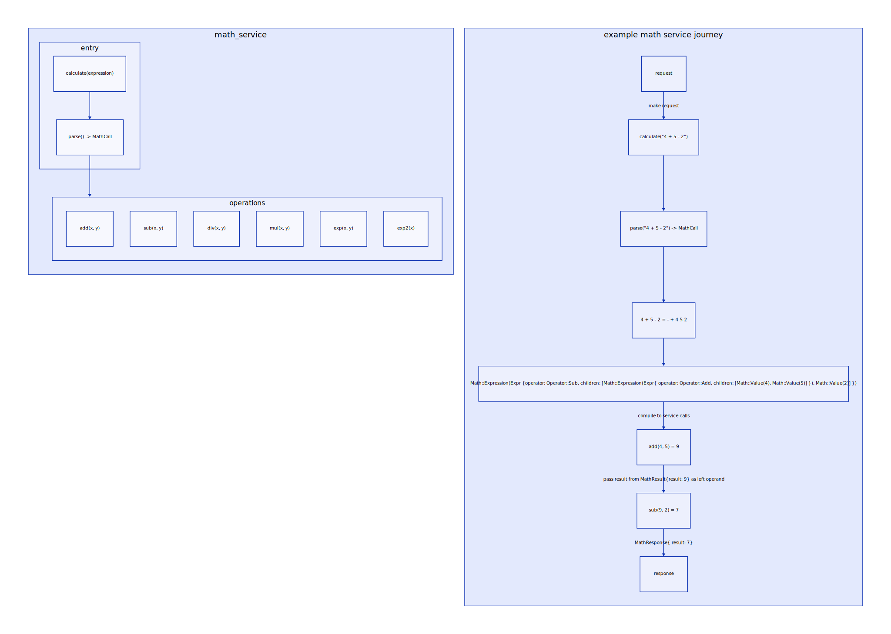

# SVC-MAT - Distributed math services

- Objective: Serves as a pathfinder for desigining:
  - services calling eachother
    - registering services with [client-side service discovery](https://microservices.io/patterns/client-side-discovery.html)
      on init
  - tracing requests
  - logging

## SVC-MAT-3 [PR](https://github.com/Dolpheyn/dist-rust-buted/pull/11)

- [x] Mat entrypoint service - calc
 - start all operations server
 - parse expression into an expression tree
 - eval expression tree into calls to operations server

## SVC-MAT-2

- [ ] Exp2(square) service
  - Calls the Exp service with exponent = 2

## SVC-MAT-1

- [x] Implement Add, Sub, Div, Mul, Exp services
  - Each is in their own directory

## SVC-MAT-0 [PR](https://github.com/Dolpheyn/dist-rust-buted/pull/6)

- [x] Create proto for math services
  - Add, Sub, Div, Mul, Exp, Exp2(square)
